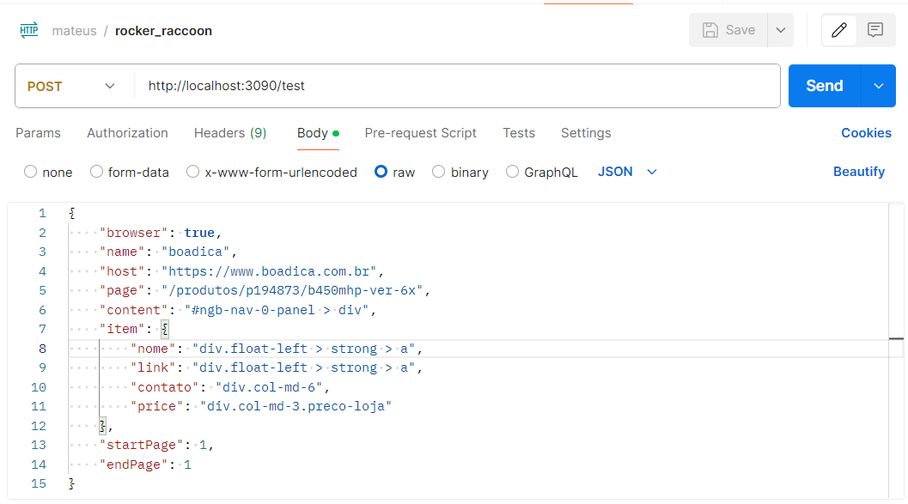
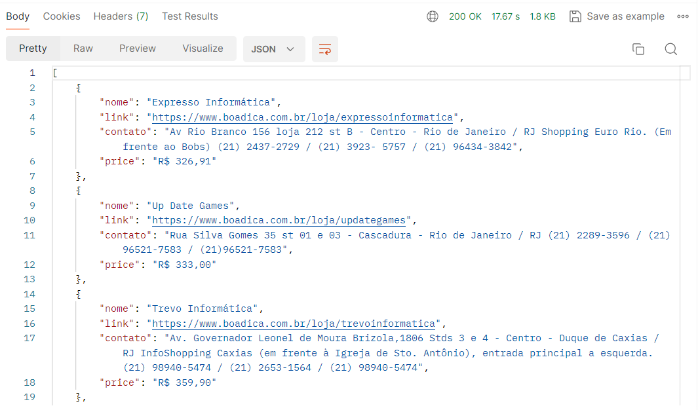

<p align="center">
  
</p>


<div align="center">
    <h3>"Não há nada como eu, a não ser eu mesmo"</h3>
    <h3> (Rocket Raccon) </h3>
</div>


The intention of this project, is get some information web page \
like webScraping, but try to simplify way to retrivie data, \
let's verify how we can configure and use this project,

Tecnologies:
```
    - nodejs
    - cheerio
    - express
    - puppeteer
```


###  IF ON IN THE INTERNET IS A PUBLIC THING

--- 

This is a example of payload:

```
{
    "browser": true,
    "name": "boadica",
    "host": "https://www.boadica.com.br",
    "page": "/pesquisa/compu_notebook/precos?ClasseProdutoX=1&CodCategoriaX=2&XT=2&XE=6&XJ=5&curpage={page}",
    "content": "div.row.preco.detalhe",
    "item": {
        "name": "div.pull-left",
        "price": "div.col-md-1.preco",
        "description": "div.col-md-4.center",
        "link": "div.col-md-4.center;div.no-mobile;a"
    },
    "startPage": 1,
    "endPage": 1
}
```

---

### BROWSER - SPA

The command:

```
"browser": true,
```

meaning the software will open a browser to load page on tecnologi SPA \
waiting render to retrivied informaiton to do scraping


---

### PAGINATION

The "HOST" will be concatenated with "PAGE" to do request:

```
host + page
```

If your page make pagination by the url add this tag to will be increment:

```
{page}
```

by the example:
```
"/pesquisa/compu_notebook/precos?ClasseProdutoX=1&CodCategoriaX=2&XT=2&XE=6&XJ=5&curpage={page}",
```

This parameter on body:

```
"numberPages": 1
```

Meaning the tag {page} will be incremented until the max "numberPages";

---
### CONTENT

The parameter "content":

```
"content": "div.row.preco.detalhe",
```

You need to search the tag of line you want to filter.
Inspect the element on html click rigth button:
```
copy -> copy selector
```
you will get something like:
```
#ngb-nav-0-panel > div:nth-child(1)
```

Remove config identify "loop" id of item like:

```
#ngb-nav-0-panel > div
```

Like this way the system will search many tags in the same pattern.

---

### ITEM

The parameter "item", meaning exactly the list of objects in json \
you will be received the response something like this has success:

```
"item": {
        "name": "div.pull-left",
        "price": "div.col-md-1.preco",
        "description": "div.col-md-4.center",
        "link": "div.col-md-4.center;div.no-mobile;a"
},
```
Don't exist limit to add parameter on the object "item"

The code will be make a pattern to deal with like this attributes names:
```
- price
- link
```
Don't worry.


---

### SOME RULES OBSERVED:

- the class CSS can't be complemented with space, you need to me replace by dot (.)

  example:

before:
```
div.src__ProductContainer-sc-7qsif4-3 cFwTod
```

after: (add dot replacing space)

```
div.src__ProductContainer-sc-7qsif4-3.cFwTod
```

--- 

### example of run and response:



